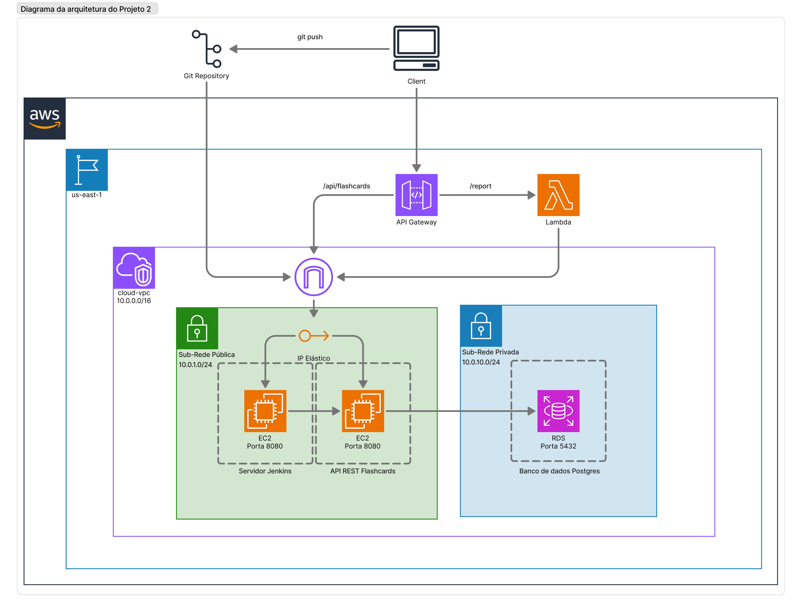

# Projeto Integrador – Cloud Developing 2025/2

> CRUD simples + API Gateway + Lambda /report + RDS + CI/CD

**Grupo**:

1. 10403760 - Anderson Correa Nicodemo - Lambda, Testes e Documentação
2. 10427415 - Guilherme Silva Dias - Pipeline Jenkins
3. 10420414 - Raffael Esteves - Docker, VPC, EC2, RDS e API Gateway


## 1. Visão geral

Para a elaboração deste projeto escolhemos fazer um API REST de Flashcards, por se tratar de um objeto de estudos muito utilizado por nós e achamos interessante aplicá-lo em nosso projeto devido aos atributos diferentes que ele pode conter para ser criado nas requisições HTTP. Com isso, nosso API REST é capaz de realizar operações de consulta simples e com parâmetros, criação, atualização e exclusão de objetos flashcards do banco de dados.

## 2. Arquitetura



| Camada | Serviço | Descrição |
|--------|---------|-----------|
| Backend | EC2 + Docker | API REST Java e Springboot |
| Banco   | Amazon RDS              | PostgreSQL em subnet privada |
| Gateway | Amazon API Gateway      | Rotas CRUD → EC2 · `/report` → Lambda |
| Função  | AWS Lambda              | Consome a API, gera estatísticas JSON |
| CI/CD   | Jenkins   | push → jenkins → build → deploy |

## 3. Como rodar localmente

```bash
# Com as instâncias EC2 executando
# Acessar a instância do API REST ou do Jenkins
ssh -i ./keys/cloud-key.pem ec2-user@<ip-publico>

# Na instância API REST
cd /projeto-nuvem

# Realiza o build e executa a API na porta 8080
docker compose up --build -d


# Na instância do Jenkins
# Realiza a pipeline, o build e executa a API na porta 8080
sudo service jenkins start

# URL da API → http://35.170.95.1:8080/api/flashcards
# URL do Jenkins → http://3.217.176.0:8080

